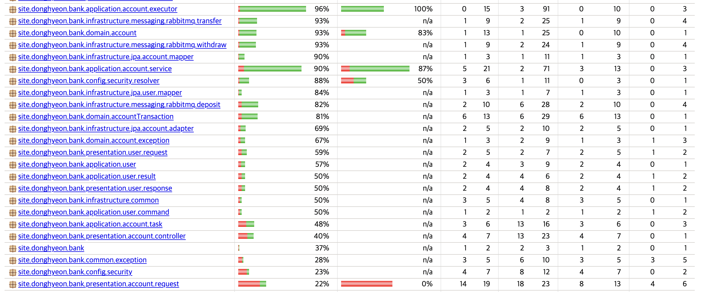

# 송금 서비스 설계

계좌 간 송금 시스템을 설계하고 구현하고자 합니다.  
이를 통해 읽기 전용 필드와 DB 설계 관점의 최적화를 중심으로 구현하는 것을 목표로 합니다.  

---

## 요구사항
1. 계좌 등록 / 삭제   
사용자는 계좌를 생성하고 삭제할 수 있다.  
계좌는 고유한 식별자를 가지며, 잔액 상태를 관리한다.


2. 입-출금 및 이체  
   - 입금  
   특정 계좌에 금액을 입금할 수 있다.
   - 출금  
   특정 계좌에서 금액을 출금할 수 있다.  
   1일 최대 1,000,000원의 한도를 가진다.
   - 이체   
   출금 계좌에서 다른 계좌로 금액을 이체한다.  
   이체 금액의 1%의 수수료가 발생한다.  
   1일 최대 3,000,000원의 한도를 가진다.


3. 거래내역 조회  
지정된 계좌의 송금 및 수취 내역을 조회할 수 있다.  
내역은 최신순으로 정렬하여 반환한다.

---

## 외부 라이브러리 및 오픈소스
### postgreSQL
기본적으로 강한 정합성과 명확한 트랜잭션 경계를 보장하기 위해 RDBMS를 사용했습니다.  
은행 도메인의 특성상 엄격한 정합성과 대용량 데이터의 안정적인 처리가 필수적이며,  
partial index, CHECK 제약 등 MySQL에 비해 제약 조건과 인덱스 설계 측면에서 표현력이 풍부하다는 점에서 PostgreSQL을 선택했습니다.  

또한, 개인적으로 mySQL보다 더 익숙해서 안정적으로 운용할 수 있다고 판단해 선택했습니다.

---

### RabbitMQ
계좌 단위 직렬 처리와 분산 서버 환경을 동시에 고려했을 때,  
공유 자원에 대한 동시성 제어를 애플리케이션 레벨 락이 아닌  
메시지 큐 기반 작업 직렬화로 해결하는 것이 요구 조건에 가장 부합한다고 판단했습니다.

이 과정에서 Kafka, Redis Stream, Redis Pub/Sub을 함께 검토했습니다.
- Kafka  
이벤트 로그를 장기간 보존하거나,  
여러 소비자가 동일한 이벤트를 각기 다른 관점으로 소비해야 하는 경우에 의미가 크다.  
그러나 본 요구사항은 이벤트 기록보다는 단일 작업의 정확한 처리와 완료 보장에 가깝다.  
- Redis Stream
기본적으로 한 소비자가 읽고 ACK 후 커서를 전환하는 구조이기 때문에,  
입금 처리와 거래 내역 저장을 각각 단일 책임 워커로 분리해 fan-out 하려면  
워커 간 재발행 흐름이 필요해지고, 이는 처리 구조를 불필요하게 복잡하게 만든다.  
- Redis Pub/Sub  
메시지 유실 가능성이 존재하여, 계좌 잔액과 같이 정합성이 핵심인 도메인에서는 사용할 수 없다.  

특히,
- 계좌 단위 직렬 처리
- 입출금 및 거래 내역 저장의 단일 트랜잭션
- 실패 시 재시도 및 처리 보장

을 종합적으로 고려했을 때,  
작업 큐로서의 성격이 명확한 RabbitMQ가 가장 적절한 선택이라고 판단했습니다.

---

### Redis
전역 캐시 및 분산 환경에서의 상태 공유를 고려했습니다.  
단일 서버 환경에서는 내부 캐시만으로도 충분할 수 있으나,  
서버 스케일 아웃을 전제로 할 경우 공용 캐시 계층이 필요하다고 판단했습니다.    

- 이체 한도 관리
- 중복 처리 방지를 위한 보조 캐시
- 빠른 조회가 필요한 읽기 데이터

등의 사용처에서, Redis는 안정적인 성능을 제공하기에 채택했습니다.  

---

### Keycloak
유저 도메인과 인증/인가 책임을 명확히 분리하기 위해 Keycloak을 도입했습니다.  

애플리케이션은 '인증된 주체가 어떤 권한을 가지는가'에 대해서만 집중하고,  
인증 방식, 토큰 관리, 보안 정책은 외부 시스템에 위임하는 구조를 그렸습니다.  

이를 통해, 유저 도메인의 책임을 단순화하고,  
인증 정책 변경이 비즈니스 로직에 영향을 주지 않도록 설계했습니다.  

---

### Swagger
API 명세를 코드와 함께 관리하기 위해 Swagger(OpenAPI)를 사용했습니다.

---

### Testcontainers
비동기 처리 및 메시지 기반 아키텍처 테스트를 위해 사용했습니다.  
- RabbitMQ
- Redis

처럼 메시징 관련 시스템을 사용하고 있고, 이를 테스트 환경에서 재현함으로써,  
단순한 단위 테스트로는 검증하기 어려운 비동기 흐름을 검증할 수 있다고 판단했습니다. 

---

## 실행 방법

### 실행 환경
- Docker
- Docker compose
- java 17
- spring boot 4.0.1

---

### 환경 변수 (예시)
- .env.db
```text
POSTGRES_USER=admin
POSTGRES_PASSWORD=1234
POSTGRES_DB=bank
```
- .env.server
```text
SPRING_PROFILES_ACTIVE=prod
SPRING_DATASOURCE_URL=jdbc:postgresql://postgres:5432/bank
SPRING_DATASOURCE_USERNAME=admin
SPRING_DATASOURCE_PASSWORD=1234
```
---

## 테스트 커버리지

jacoco를 활용해 커버리지를 측정했습니다.  

